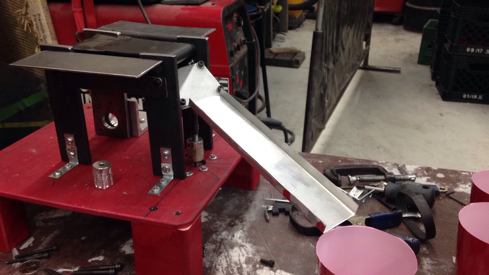

# About
This was a past group project. The course requirements are to build a device capable of differentiating four different types of nuts and sorting them into cups. My focus was on the mechanical design and manufacturing of the system.

The nuts roll through different sensing areas along a conveyor belt before being dropped into a chute which rotates to deliver them into the appropriate cup. The device must be capable of differentiating between different materials and sizes of nuts. The main electronic components used are an Arduino microcontroller, two stepper motors, a weight sensor, and break-beam sensor.

