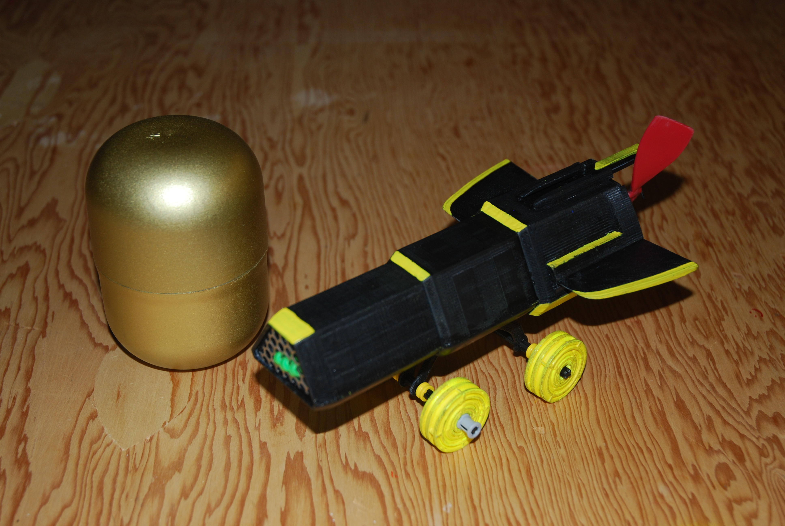

# About
This was a past group project. The course requirements were to design a 3D printable "Kinder Egg" vehicle capable of travelling 2.5 meters. Special attention was given to designs with sharp aesthetics, speed, or large size. The full toy assembly needed to fit within the Kinder Egg container. 

The goal of the group was to create a space shuttle style vehicle with the largest total size of the competition. My focus was the design and CAD of the device.
  
    

